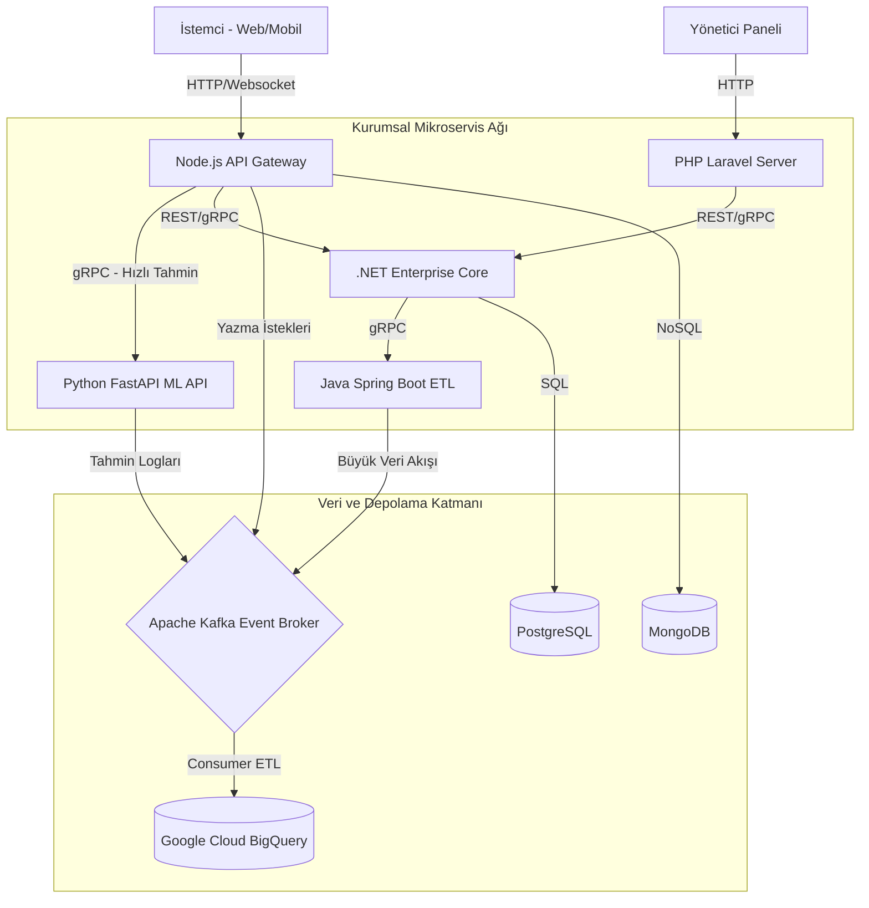
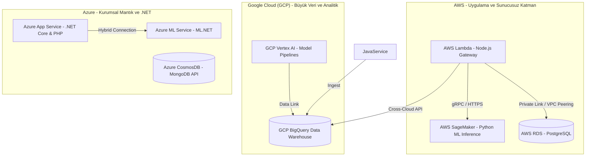

# Sistem Mimarisi ve Mikroservis Tasarımı

Bu döküman, **Python, .NET, Java, Node.js, PHP** dillerinin bir arada çalıştığı hibrit, çoklu bulut (Multi-Cloud) tabanlı **Akıllı Veri Analitiği ve Makine Öğrenmesi Uygulaması**'nın sistem mimarisini ve entegrasyon stratejisini açıklar.

---

## 1. Çoklu Dil (Multi-Language) Rol Dağılımı ve Görevleri

Sistemde kullanılan her programlama dili, en güçlü olduğu uzmanlık alanına göre konumlandırılmıştır:

| Teknoloji / Dil | Sistemdeki Rolü | Konumlandırıldığı Katman | Neden Tercih Edildi? |
| :--- | :--- | :--- | :--- |
| **Node.js (Express/NestJS)** | API Gateway, Kimlik Doğrulama (Auth), Gerçek Zamanlı (Websocket) İletişim | Dışa Açık Katman (Frontend-Facing) | I/O yoğun işlerde yüksek asenkron performans ve zengin ekosistem. |
| **PHP (Laravel/Symfony)** | Yönetim Paneli, Raporlama Arayüzleri, Back-office İşlemleri | Sunucu Taraflı Arayüz (SSR) | Hızlı geliştirme süresi, güçlü ORM (Eloquent) ve kurumsal CMS özellikleri. |
| **Python (FastAPI)** | Model Eğitimi, ML Çıkarım (Inference) Servisi, ETL & BigQuery Bağlantıları | AI / ML Çekirdek Katmanı | PyTorch, TensorFlow ve Scikit-learn kütüphaneleriyle doğrudan entegrasyon. |
| **.NET (C# / ML.NET)** | Kurumsal Raporlama, Finansal/Tablo Veri Analitiği, ML.NET Servisleri | İş Mantığı (Enterprise Logic) | Güçlü tip güvenliği, yüksek bellek performansı ve Azure ekosistemiyle uyum. |
| **Java (Spring Boot)** | Büyük Veri İşleme (ETL), Kuyruk Tüketimi (Kafka), Veritabanı Senkronizasyonu | Veri Entegrasyon Katmanı | Enterprise-grade kararlılık, gelişmiş çoklu iş parçacığı (multithreading) yönetimi. |

---

## 2. Mikroservisler Arası İletişim Protokolleri

Mikroservisler birbirleriyle iki temel yöntemle haberleşir:

1. **Senkron İletişim (gRPC & REST):**
   * **gRPC (Protocol Buffers):** Düşük gecikmeli ve yüksek performanslı veri iletimi gerektiren durumlarda kullanılır. Örneğin, *Node.js API Gateway* veya *Java ETL Servisi*, *Python ML Servisi*'nden anlık tahmin isterken gRPC kullanır.
   * **REST (HTTP/2 JSON):** Dış istemciler ve yönetici paneli (PHP) ile yapılan entegrasyonlarda tercih edilir.
   
2. **Asenkron İletişim (Event-Driven - Kafka/RabbitMQ):**
   * Tahmin sonuçlarının loglanması, BigQuery veri ambarına aktarılması ve model yeniden eğitim (retraining) tetikleyicileri asenkron mesaj kuyrukları üzerinden yönetilir.

---

## 3. Çoklu Bulut (Multi-Cloud) Servis Dağılım Haritası

Sistemin AWS, GCP ve Azure üzerindeki en mantıklı dağılımı aşağıdaki gibidir. Bu yapı, her bulut sağlayıcısının en avantajlı olduğu servisleri (GCP BigQuery, AWS SageMaker/Lambda, Azure AD) tek mimaride birleştirir.

### Bulut Sağlayıcı Dağılım Tercih Nedenleri:
*   **GCP:** BigQuery, analitik sorgularda ve veri ambarı operasyonlarında sektör standardıdır. ML modellerini besleyecek büyük veri analizleri burada gerçekleşir.
*   **AWS:** SageMaker ve AWS Lambda sunucusuz API dağıtımı, hızlı ölçeklenme ve operasyonel maliyet avantajı sağlar.
*   **Azure:** Kurumsal .NET servisleri ve aktif dizin (Active Directory) entegrasyonu için en güvenli ve yerel ortamı sunar. ML.NET modelleri Azure ML ile sorunsuz bir şekilde yönetilir.
