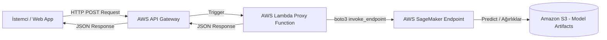

# Bulut Dağıtım (Deployment) Stratejisi

Bu döküman, eğitilen makine öğrenmesi modellerinin **AWS (Amazon Web Services)** üzerinde nasıl canlıya alınacağını (deployment) ve sunucusuz (serverless) bir yapı ile dış dünyaya güvenli bir şekilde nasıl açılacağını açıklar.

Altyapı tasarımı ve dağıtımı için **Terraform** (Infrastructure as Code - IaC) konfigürasyonu referans şablonu olarak sunulmuştur.

---

## 1. Mimari Dağıtım Şeması (AWS Serverless API Serving)



### Bileşenlerin Görevleri:
1.  **Amazon S3:** Model eğitiminin çıktısı olan model dosyalarını (`model.tar.gz` formatında) saklar.
2.  **AWS SageMaker Endpoint:** Gerçek zamanlı veya sunucusuz (Serverless Inference) olarak yapılandırılmış, model çıkarımlarını (predictions) yürüten ve otomatik ölçeklenen Docker konteyneridir.
3.  **AWS Lambda:** API Gateway'den gelen istek verisini doğrular, modeli besleyecek biçimde yeniden şekillendirir (preprocessing), SageMaker Endpoint'ini çağırır ve dönen tahmini alır.
4.  **AWS API Gateway:** HTTPS protokolü üzerinden istekleri karşılar, JWT/OAuth2 tabanlı kimlik doğrulama sağlar, hız sınırlaması (Throttling) uygular ve Lambda'yı tetikler.

---

## 2. Altyapı Tanımlama Kodu (Terraform - `main.tf`)

Aşağıdaki Terraform kodu, yukarıda açıklanan bulut altyapısını AWS üzerinde sıfırdan kurmak için gerekli tüm kaynak tanımlarını içerir:

```hcl
# AWS Sağlayıcı Tanımı
provider "aws" {
  region = "eu-central-1" # Frankfurt Bölgesi
}

# 1. Model Ağırlıklarının Tutulacağı S3 Bucket
resource "aws_s3_bucket" "model_bucket" {
  bucket = "smart-analytics-ml-models-prod"
}

# 2. SageMaker IAM Rolü (S3'ten modeli okuyabilmesi için)
resource "aws_iam_role" "sagemaker_role" {
  name = "sagemaker-execution-role"

  assume_role_policy = jsonencode({
    Version = "2012-10-17"
    Statement = [
      {
        Action = "sts:AssumeRole"
        Effect = "Allow"
        Principal = {
          Service = "sagemaker.amazonaws.com"
        }
      }
    ]
  })
}

# 3. SageMaker Model Kaynağı
resource "aws_sagemaker_model" "ml_model" {
  name               = "smart-prediction-model"
  execution_role_arn = aws_iam_role.sagemaker_role.arn

  primary_container {
    image          = "763104351884.dkr.ecr.eu-central-1.amazonaws.com/pytorch-inference:2.0.0-cpu-py310" # AWS Resmi PyTorch Konteyneri
    model_data_url = "s3://${aws_s3_bucket.model_bucket.id}/models/model.tar.gz"
  }
}

# 4. SageMaker Endpoint Konfigürasyonu (Serverless Inference)
resource "aws_sagemaker_endpoint_configuration" "endpoint_config" {
  name = "smart-prediction-endpoint-config"

  production_variants {
    variant_name          = "AllTraffic"
    model_name            = aws_sagemaker_model.ml_model.name
    
    # Sunucusuz çıkarım (Serverless Inference) ayarı
    serverless_config {
      max_concurrency   = 10
      memory_size_in_mb = 3072 # 3GB Ram
    }
  }
}

# 5. Canlı SageMaker Endpoint
resource "aws_sagemaker_endpoint" "endpoint" {
  name                 = "smart-prediction-endpoint"
  endpoint_config_name = aws_sagemaker_endpoint_configuration.endpoint_config.name
}

# 6. Lambda Rolü (SageMaker Endpoint'ini tetikleyebilmesi için)
resource "aws_iam_role" "lambda_role" {
  name = "lambda-sagemaker-proxy-role"

  assume_role_policy = jsonencode({
    Version = "2012-10-17"
    Statement = [
      {
        Action = "sts:AssumeRole"
        Effect = "Allow"
        Principal = {
          Service = "lambda.amazonaws.com"
        }
      }
    ]
  })
}

# Lambda'ya SageMaker Çağırma ve Loglama İzni Veren Policy
resource "aws_iam_policy" "lambda_policy" {
  name        = "lambda-sagemaker-policy"
  description = "Allows Lambda to invoke SageMaker endpoint and log to CloudWatch"

  policy = jsonencode({
    Version = "2012-10-17"
    Statement = [
      {
        Effect = "Allow"
        Action = [
          "sagemaker:InvokeEndpoint",
          "logs:CreateLogGroup",
          "logs:CreateLogStream",
          "logs:PutLogEvents"
        ]
        Resource = "*"
      }
    ]
  })
}

resource "aws_iam_role_policy_attachment" "lambda_logs" {
  role       = aws_iam_role.lambda_role.name
  policy_arn = aws_iam_policy.lambda_policy.arn
}

# 7. Lambda Proxy Fonksiyonu
resource "aws_lambda_function" "sagemaker_proxy" {
  filename      = "lambda_function.zip" # Önceden paketlenmiş kod
  function_name = "sagemaker-prediction-proxy"
  role          = aws_iam_role.lambda_role.arn
  handler       = "lambda_function.lambda_handler"
  runtime       = "python3.10"
  timeout       = 15

  environment {
    variables = {
      SAGEMAKER_ENDPOINT_NAME = aws_sagemaker_endpoint.endpoint.name
    }
  }
}

# 8. API Gateway REST API Kurulumu
resource "aws_api_gateway_rest_api" "ml_api" {
  name        = "SmartMLPredictAPI"
  description = "API Gateway for ML Predictions"
}

resource "aws_api_gateway_resource" "predict_resource" {
  rest_api_id = aws_api_gateway_rest_api.ml_api.id
  parent_id   = aws_api_gateway_rest_api.ml_api.root_resource_id
  path_part   = "predict"
}

resource "aws_api_gateway_method" "predict_method" {
  rest_api_id   = aws_api_gateway_rest_api.ml_api.id
  resource_id   = aws_api_gateway_resource.predict_resource.id
  http_method   = "POST"
  authorization = "NONE" # Prod ortamda AWS Cognito veya custom authorizer kullanılabilir
}

# API Gateway - Lambda Entegrasyonu (Proxy Integration)
resource "aws_api_gateway_integration" "lambda_integration" {
  rest_api_id             = aws_api_gateway_rest_api.ml_api.id
  resource_id             = aws_api_gateway_resource.predict_resource.id
  http_method             = aws_api_gateway_method.predict_method.http_method
  integration_http_method = "POST"
  type                    = "AWS_PROXY"
  uri                     = aws_lambda_function.sagemaker_proxy.invoke_arn
}

# Lambda'ya API Gateway'den tetiklenme izni verilmesi
resource "aws_lambda_permission" "apigw_lambda" {
  statement_id  = "AllowExecutionFromAPIGateway"
  action        = "lambda:InvokeFunction"
  function_name = aws_lambda_function.sagemaker_proxy.function_name
  principal     = "apigateway.amazonaws.com"
  source_arn    = "${aws_api_gateway_rest_api.ml_api.execution_arn}/*/*"
}

# API'yi Canlıya Alma (Deployment)
resource "aws_api_gateway_deployment" "api_deployment" {
  depends_on  = [aws_api_gateway_integration.lambda_integration]
  rest_api_id = aws_api_gateway_rest_api.ml_api.id
  stage_name  = "prod"
}

# Çıktı URL'si
output "api_url" {
  value       = "${aws_api_gateway_deployment.api_deployment.invoke_url}/predict"
  description = "Canlı tahmin isteklerinin gönderileceği uç nokta URL'si"
}
```

---

## 3. Güvenlik ve İzleme (Security & Monitoring)

1.  **VPC Yapılandırması:** SageMaker endpoint'leri ve proxy Lambda fonksiyonu, genel internete kapalı olarak özel bir **Virtual Private Cloud (VPC)** içinde ve özel alt ağlarda (Private Subnets) çalıştırılmalıdır.
2.  **API Yetkilendirmesi:** API Gateway metoduna **AWS Cognito User Pool** veya **Custom Lambda Authorizer** eklenerek sadece yetkili kullanıcıların ve API anahtarına (API Key) sahip mikroservislerin tahminde bulunması sağlanır.
3.  **Hız Sınırlama (Throttling):** Kötüye kullanımı önlemek adına API Gateway üzerinde IP ve Token bazlı hız sınırları belirlenmelidir.
4.  **İzleme & Alarm (CloudWatch):**
    *   **Lambda:** Yürütme süresi, hata oranları izlenir.
    *   **SageMaker:** *InferenceLatency* (tahmin gecikme süresi) ve sunucusuz soğuk başlatma (Cold Start) süreleri takip edilerek gerektiğinde concurrency limitleri optimize edilir.
