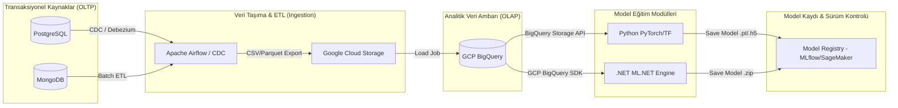

# Makine Öğrenmesi Boru Hattı (ML Pipeline)

Bu döküman, ilişkisel (PostgreSQL) ve ilişkisel olmayan (MongoDB) veritabanlarından alınan ham verilerin BigQuery veri ambarına aktarılması, analiz edilmesi ve ardından **Python (TensorFlow/PyTorch)** veya **.NET (ML.NET)** kullanılarak eğitilmesi süreçlerini adım adım açıklar.

---

## 1. Uçtan Uca ML Boru Hattı Akış Şeması



---

## 2. Adım Adım Boru Hattı İşlemleri

### Adım 1: Veri Toplama (Data Ingestion) ve Aktarım
*   **PostgreSQL:** Müşteri bilgileri, finansal işlemler ve sipariş kayıtları gibi yapısal verileri barındırır.
*   **MongoDB:** Kullanıcı tıklama logları, JSON payload'ları ve yarı-yapısal verileri saklar.
*   **Aktarım (ETL/CDC):** 
    *   **Gerçek Zamanlı (CDC):** Debezium ve Apache Kafka kullanılarak PostgreSQL'deki `INSERT/UPDATE` logları anlık olarak yakalanır.
    *   **Zamanlanmış İşler (Batch):** Apache Airflow veya Google Cloud Dataflow, MongoDB ve PostgreSQL'den günlük verileri çekerek Google Cloud Storage (GCS) üzerine Parquet formatında yazar.
    *   **BigQuery Yükleme:** Parquet dosyaları otomatik olarak BigQuery tablolarına şema eşleştirmesi ile yüklenir.

### Adım 2: Veri Analizi ve Ön İşleme (BigQuery & Feature Engineering)
Veri bilimcileri ve veri analistleri, BigQuery'nin gücünü kullanarak milyarlarca satır veriyi saniyeler içinde ön işleme tabi tutar:
*   **SQL tabanlı temizleme:** Eksik değerlerin (null) doldurulması ve aykırı değerlerin (outliers) filtrelenmesi.
*   **Öznitelik Mühendisliği (Feature Engineering):** BigQuery SQL kullanarak kullanıcıların son 30 günlük harcama ortalamaları, tıklama oranları gibi yeni öznitelikler türetilir ve `gold_features` tablosuna yazılır.

```sql
-- Örnek BigQuery Feature Engineering Sorgusu
CREATE OR REPLACE TABLE `project_dataset.gold_features` AS
SELECT 
    user_id,
    COUNT(transaction_id) as total_tx_count,
    AVG(amount) as avg_tx_amount,
    EXTRACT(AGE FROM registration_date) as customer_tenure_days
FROM 
    `project_dataset.raw_transactions`
GROUP BY 
    user_id, registration_date;
```

---

## 3. Model Eğitimi (Model Training)

Veriler hazırlandıktan sonra, geliştirilecek modelin türüne göre iki eğitim seçeneğinden biri tetiklenir:

### A Seçeneği: Python (TensorFlow/PyTorch) ile Derin Öğrenme
Büyük veri kümelerinde derin öğrenme modelleri (Örn: Görüntü, Doğal Dil İşleme veya Karmaşık Tablosal Sınıflandırma) eğitmek için tercih edilir.

1.  **Veri Okuma:** Python scripti `google-cloud-bigquery` kütüphanesini kullanarak BigQuery tablosunu Pandas Dataframe olarak belleğe alır (Büyük veriler için `db-dtypes` veya Arrow formatı tercih edilir).
2.  **Veri Bölme:** Veri seti `train`, `validation` ve `test` olarak ayrılır.
3.  **Model Tanımlama:**
    *   **TensorFlow/Keras:** `tf.keras.Sequential` ile katmanlar oluşturulur.
    *   **PyTorch:** `nn.Module` sınıfından türetilen model sınıfı yazılır.
4.  **Eğitim:** GPU/TPU kümeleri (Vertex AI Training veya AWS SageMaker Training Jobs) üzerinde model eğitilir.
5.  **Kayıt:** Eğitilen model ağırlıkları (`model.pt` veya `saved_model/`) sürüm kontrolü için MLflow/Vertex AI Model Registry'ye yüklenir.

---

### B Seçeneği: .NET (ML.NET) ile Makine Öğrenmesi
Özellikle tablosal verilerde hızlı regresyon, sınıflandırma ve öneri sistemleri oluştururken ve .NET ekosistemine doğrudan entegre edilirken tercih edilir.

1.  **Veri Okuma:** C# uygulaması GCP BigQuery .NET Client kütüphanesini kullanarak tablodaki verileri akış (stream) olarak çeker.
2.  **Veri Yükleme:** Çekilen veriler ML.NET'in yüksek performanslı `IDataView` nesnesine aktarılır.
3.  **Pipeline Tanımlama:** Veri dönüştürme adımları (OneHotEncoding, Normalization) ve eğitim algoritması tanımlanır.
    ```csharp
    // Örnek ML.NET C# Pipeline Tanımı
    var pipeline = mlContext.Transforms.Categorical.OneHotEncoding("Category")
        .Append(mlContext.Transforms.Concatenate("Features", "avg_tx_amount", "customer_tenure_days", "Category"))
        .Append(mlContext.Regression.Trainers.Sdca(labelColumnName: "Label", featureColumnName: "Features"));
    ```
4.  **Eğitim:** `pipeline.Fit(trainingData)` komutu ile model eğitilir.
5.  **Kayıt:** Eğitilen model, bir `.zip` dosyası (`model.zip`) olarak diske veya bulut nesne depolama (Azure Blob Storage / AWS S3) alanına yazılır. Bu zip dosyası daha sonra ASP.NET Core uygulamalarında `PredictionEnginePool` ile bellek dostu bir şekilde yüklenip tahmin üretebilir.

---

## 4. Model Takibi ve Versiyonlama (MLOps)

*   Her eğitim adımında modelin doğruluğu (Accuracy, RMSE, F1-Score) ve kullanılan hiperparametreler **MLflow** veya bulut yerel servisleri (SageMaker Experiments) ile kayıt altına alınır.
*   Performansı en iyi olan model **"Challenger"** olarak etiketlenir ve otomatik testleri geçerse canlıdaki **"Champion"** modelle yer değiştirir.
